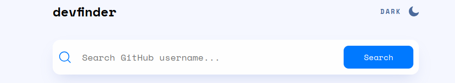
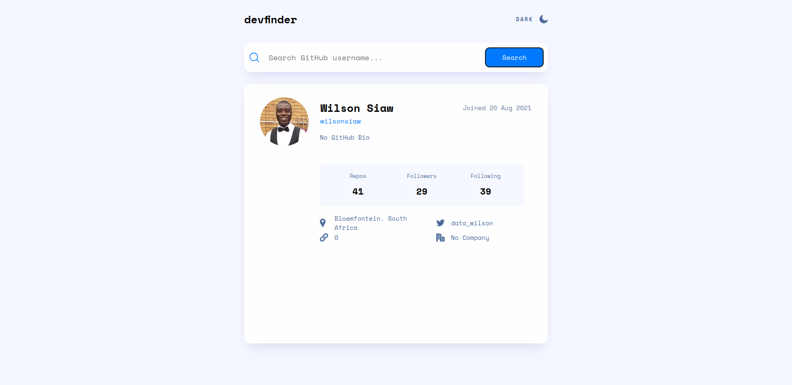
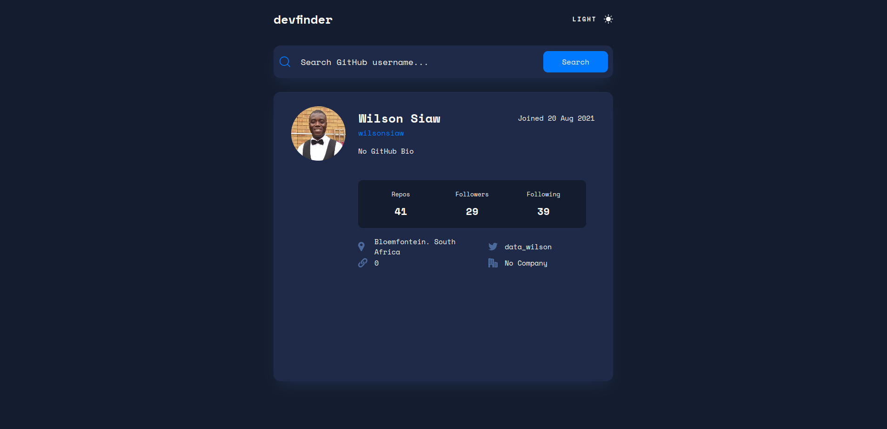

# Github User Search Application

## Introduction

In this project, I built an application using React. The application fetches data from the [Github API](https://api.github.com/users/). This project was part of my training in 
Azubi Africa Frontend Development program.

The full implementation of the project can be found [here](https://github-user-search-app-ten-pearl.vercel.app/)

### Technologies Used

### Features of the project

The project incorporates a Search field that allows users to input the name of any github user. 

Once the user has entered a username and clicked the search button, the application connects to the Github API and renders the profile information of the user.

In the image above, the application renders my user information to the application.

The application also incorporates a dark theme that users can switch to by clicking on the moon at the top right corner of the application.

